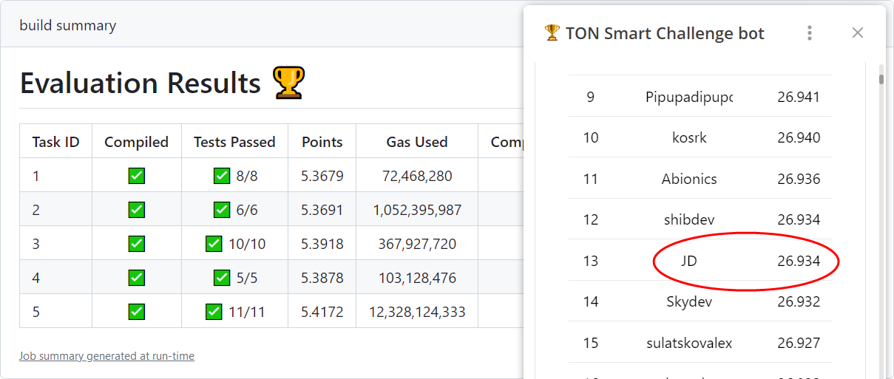

-----

# 🏆 Welcome to Tact Challenge
### by TON Foundation

## 📝 Tasks

1. [task1](/contracts/1.tact) - Counter contract 
2. [task2](/contracts/2.tact) - Proxy contract 
3. [task3](/contracts/3.tact) - Dex contract
4. [task4](/contracts/4.tact) - NFT locker contract
5. [task5](/contracts/5.tact) - NFT random swap

Each task has two parts:

- 📋 A comment with a description of what the smart contract should do.
- 💻 The code of the smart contract with one or more functions marked as `testable`.

The goal of the contestants is to provide a code that matches the description.

Each task may give the contestant either 0 or 5 to 6 score points: 5 for all tests passed plus "gas-score" from 0 to 1 (0 for "infinite" gas consumption, 1 for 0 gas consumption, dependence is inverse exponent).

Each TVM execution is limited to 100,000,000 (hundred million) gas units.
This limit is high enough that it only rules out infinite loops. Any practical solution, regardless of how (un)optimized it is, will fit.

We ask participants not to change the signature (number, order, and types of arguments and result) of `testable` functions for us to be able to evaluate their submission.

## 📅 Solution submission guide and terms

1. **Registration Process**: Before you begin, make sure to go through the registration process via the [@smartchallengebot](https://t.me/smartchallengebot?start=true). Your solutions will not be accepted if you are not properly registered.

2. **Create a Private GitHub Repository**: Clone this repository and set it as your own private GitHub repo. **Ensuring the visibility configs are set to "private"** is crucial to safeguarding your solution.

3. **Set Your Token**: Utilize the `token` provided to you during registration in Telegram bot and set it as a secret variable called USER_TOKEN in your private repository. You can learn more about setting secret variables in the [official GitHub documentation](https://docs.github.com/en/actions/security-guides/using-secrets-in-github-actions#creating-secrets-for-a-repository).

4. **Submit Your Solution**: When you are ready to submit your solution, simply push your code into your private repository. The code will be sent to the task review server, and GitHub actions will display the status of your submission.

5. **Solution Evaluation**: If at least one of your solutions works well, your submission will be counted. Feel free to push solutions for more tasks; GitHub actions will run your code against tests and count successful submissions. To see a detailed report on your submission, proceed to GitHub Actions tab and you will see a similar report along with possible errors if present:

  
| Task ID | Compiled | Tests Passed | Points | Gas Used | Compilation Error |
|---------|:--------:|:------------:|:------:|:----------------------:|:-----------------:|
| 1 | ❌ | ❌ | 0 | N/A | [Error Details](#compilation-error-task-1) |
| 2 | ✅ | ❌ 0/6 | 0 | 0 |  |
| 3 | ✅ | ✅ 10/10 | 5.127 | 491,235,717 |  |
| 4 | ❌ | ❌ | 0 | N/A | [Error Details](#compilation-error-task-4) |
| 5 | ❌ | ❌ | 0 | N/A | [Error Details](#compilation-error-task-5) |
  

6. **Check Your Points**: To check your solution points, review the logs of the GitHub action for your latest commit. Additionally, you can find your solution points in the menu button inside of the Telegram bot.

**Best of luck with your submissions!**

## ‼️ Important rules:
- It's forbidden to use any FunC/Fift code inside of submitted Tact solutions. Participants who will have FunC/Fift code in their submissions will be disqualified. This rule applies to Tact bindings as they're using a lower level of abstraction thus compromising the nature of Tact Challenge.
- Please don't share your solution's code with anybody. If someone's submission will be suspected of using your code - both participants will be disqualified. Repeated case will cause lifetime ban from TON Smart Challenges.

## 🏆 Scoring and Prizes

Winners of the contest will receive prizes denominated in Toncoin, the native cryptocurrency of TON blockchain, which is also used as a resource for contract execution.

Each task can bring you a max of 6 points. You get 5 points for solving a task. You get an extra point if you solve it without using any gas.

**Minimum amount** of points to be eligible for the prize is **6 points**.

Prizes:
- The top 15% of participants share $10,000 in TON
- The middle 30% of participants share $10,000 in TON
- The bottom 55% of participants share $10,000 in TON

Each prize pool is shared equally among the participants in that group. In total, we're giving away $30,000 in TON prizes.

The total prize might change depending on the number of participants.

## 🚀 Getting Started with TON

New to blockchain or TON development? Start here:

- [Blockchain Basics](https://blog.ton.org/what-is-blockchain)
- [TON Intro](https://docs.ton.org/learn/introduction)
- [Developer Portal](https://ton.org/dev?filterBy=developSmartContract)

### 📘 Essential Tact Resources

Master the Tact language with these must-have materials:

- [Tact by Example](https://tact-by-example.org/)
- [Tact Docs](https://tact-lang.org/)
- [Video Tutorials](https://www.youtube.com/@AlefmanVladimirEN-xb4pq/videos)
- [Join Tact Community](https://t.me/tactlang)

Find ready-to-use smart contract examples [here](https://github.com/tact-lang/awesome-tact#-smart-contracts-examples). Explore more about Tact in the [awesome-tact repository](https://github.com/tact-lang/awesome-tact).

### 🛠️ Tools for Tact Compilation and Testing

#### For Tact Challenge

For Tact Challenge we recommend cloning current repository and follow the submission guide described above.

#### To quickstart your own Tact projects

We recommend using [tact-template](https://github.com/tact-lang/tact-template) for a smooth Tact development experience:

1. Clone the [template repo](https://github.com/tact-lang/tact-template)
2. `yarn build` to build contracts
3. `yarn test` to test contracts
4. `yarn deploy` to deploy contracts

### 🌍 TON Developers Community Chats

Stay in the loop and engage with other developers:

- [TON Dev Chat (EN)](https://t.me/tondev_eng)
- [TON Dev Chat (中文)](https://t.me/tondev_zh)
- [TON Dev Chat (РУ)](https://t.me/tondev)
